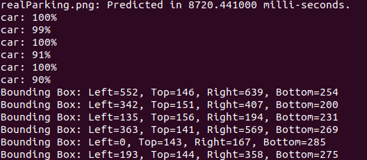

# ParkingOccupancyDetection

 

### Parking spot & occupancy detector made simple!

Parking occupancy detection has always been something important when we want to create smart parking solutions. Because this parking detection will be triggered at the edge in this repository you'll find two solutions:

- Edge parking spot and occupancy detection. This solution will be completely computed at the edge with no need to communicating to the cloud! Note that this case it's usually common as SLAs nowadays can be very restrictive!
- Cloud parking spot and occupancy detection. This solution will be completely done at cloud (we'll use AWS!) using the AWS Rekognition service! Because of it's great availability and computational power results will be greater than at the edge but because we have to go to cloud latency might be an issue!


After understanding which solutions I'll provide now I'll go step by step explaining how each of this solutions will work:

## Implementation overview

Before diving into the implementations it's really important to have an overview of the solution before getting into details. Now, let's answer a fast custom FAQ by me:

- A set of parking spots in a certain place usually change shape / distribution ? Answer is NO (and if that's the case it'll happen very rarely or to exceptional conditions)

- How do we detect a parking spot is available or not? We can use ultrasonic sensors, LIDAR or many other technologies but in this case we'll use a simple webcam that costs ~15$ 

- When looking for parking spot occupancy changes do we really need to recognize each second? Answer is NO. Because OpenCV capabilities we'll compute image differences at each second (L1, L2) and if nothing has changed why expend computation / energy? :D Because of the easy computation of 2 images difference on OpenCV this operation will be fast. If you want to find an example on how this works head to cloud/awsrekognition/testingImageDiffCrop/ directory to see it in action! __Note that we'll be only looking at differences on the regions of image which parking spot corresponds to. For example, if a bird comes by on the sky we'll not detect that as a difference!__


Now that we have a clearer vision on the problem and solution this software will follow a really simple structure:

1. Detect parking spots. This parking spot detection will have to be done manually (remember, parking spots do not change!). Software will be smart enough to detect cars and ask you if they are in a spot so you don't have to manually enter all of them :)

2. Detect parking occupancy. This step think it as a service. Once parking spots are detected this can run 24/7. It'll compare parking spot bounding boxes to car bounding boxes. If any car bounding box fits a parking spot bounding box is set as occupied (easy, right?). Look at this example

Note that both implementations will follow the same schema but they will differ at the rekognition action.

## Edge implementation

### This edge implementation has been tested in Raspberry Pi Model 3B+! 

Nowadays edge devices are constrained (compared to cloud!) and because of this lack of power we'll need to adapt to it. YOLO software have done an amazing work doing exactly that, so, that's what we'll be using for detecting cars! Now, because by default YOLO does not save detections with bounding boxes (needed for comparing with car bounding boxes to detect occupancy!) we'll need to modify source code (edge/darknet-modified/darknet/src/image.c) and add a few lines (__this is already done on the repo, is just only fyi__):

At function __void draw_detections_v3(image im, detection *dets, int num, float thresh, char **names, image **alphabet, int classes, int ext_output)__ we'll add the following:
```
		printf("Bounding Box: Left=%d, Top=%d, Right=%d, Bottom=%d\n", left, top, right, bot); 
```

Recompile with the following command at edge/darknet-modified/darknet directory:

```
make
```

And now we'll have the bounding boxes results printed at rekognition :)

 

More info about YOLO and it's usage https://pjreddie.com/darknet/yolo/


## Cloud implementation

Cloud has always been known as a component which has a variety of services and huge computational power. Because of this, many of the services we use nowadays are cloud-based but we, as developers, sometimes we suffer the cost of these services. That's why we'll be using a service that it's really cheap and probably you won't pay anything (thanks for the free tier AWS :D). That service will be AWS Rekognition.

AWS Rekognition is a widly known service and it's used for labeling images and detecting which objects are within the image we provide to AWS. Note that because of the nature of this service, everyday gets better (the more images we feed to AWS, the better it gets!) so AWS it's a great choice (note that I'm using AWS but we could use any cloud provider!).


