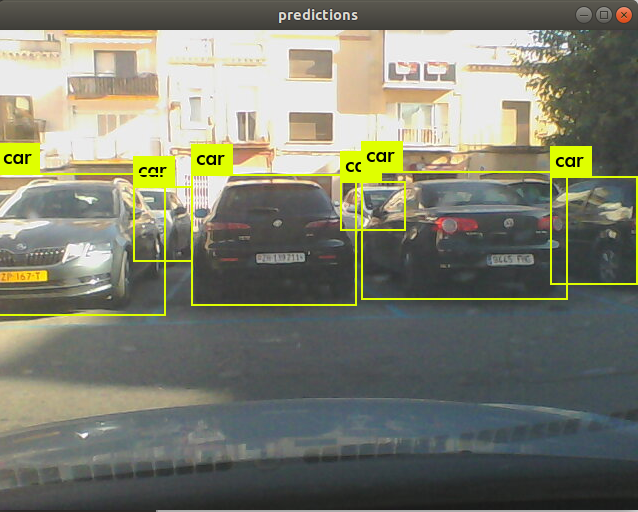
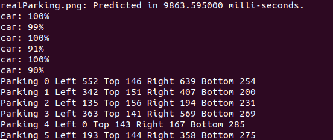
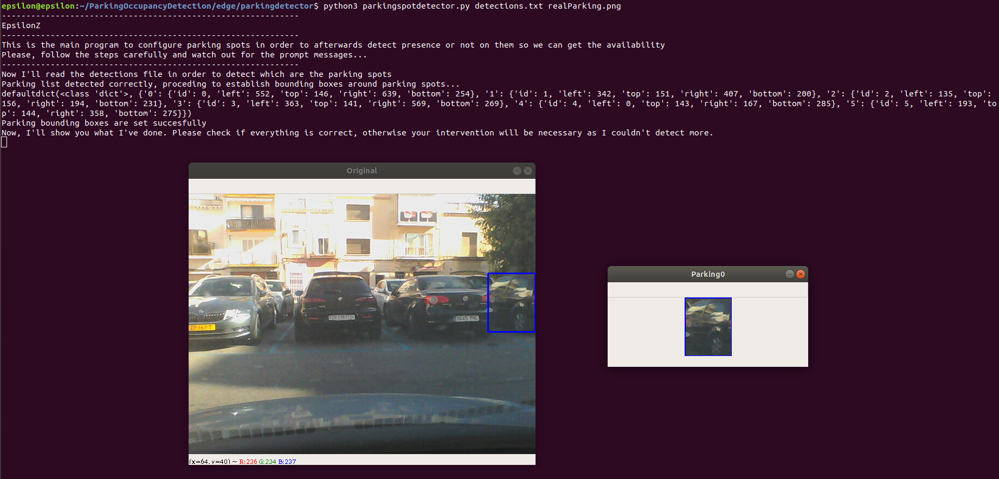
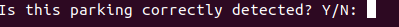

# EDGE

## INSTALL

You'll need to install OpenCV library!

### SPECIFY REKOGNITION HARDWARE (NVIDIA GRAPHIC CARD)

__If you do not have an NVIDIA Graphic Card look for SPECIFY REKOGNITION HARDWARE (CPU BASED) header__

NVIDIA has done an amazing work at it's amazing libraries and that's why they are widly used. That's why we'll need to install them to perform rekognitions with darknet software:

1. Install latest CUDA library following NVIDIA instructions

### SPECIFY REKOGNITION HARDWARE (CPU BASED)

Head to darknet-modified/darknet/Makefile file with your favorite editor and change this line:

```
GPU=1
```

To:

```
GPU=0
```

Now head to darknet-modified/darknet/ and recompile everything:

```
make
```
__Note: ignore warnings that may appear, everything is good:)__

### Test

## 1. Detecting parking spots (this will only be done once per a set of parking spots!)

Go to darknet-modified/darknet/ directory and execute the following command:

```
./darknet detect cfg/yolov3.cfg yolov3.weights realParking.png
```
__NOTE: realParking.png will be your parking spots taken image__

And now you'll see the following result:

 

With the following results printed on cmd:

 

Once we have done this we'll copy the bounding boxes result to a file called __detections.txt__ with the bounding box output:

```
Parking 0 Left 552 Top 146 Right 639 Bottom 254
Parking 1 Left 342 Top 151 Right 407 Bottom 200
Parking 2 Left 135 Top 156 Right 194 Bottom 231
Parking 3 Left 363 Top 141 Right 569 Bottom 269
Parking 4 Left 0 Top 143 Right 167 Bottom 285
Parking 5 Left 193 Top 144 Right 358 Bottom 275
```

Once you've done this copy this file and source image to parkingdetector/ directory:

```
cp detections.txt ../parkingdetector/
cp realParking.png ../parkingdetector/
```

Now that you've done this head to parkingdetector/ directory and execute the following command:

```
cd ../parkingdetector/
python3 parkingspotdetector.py detections.txt realParking.png
```

And the python3 program will start asking if the vehicles that it detected are in the parking spots you want to label (it'll make everything faster!):

 

For each vehicle a question will be asked to confirm if it's a parking spot!

 

At the end, program will ask you if everything is correct and if that's not the case you'll have to manually label the bounding boxes of the parking spot that are left to detect!

At the end, a file like this one will be generated labeling all the parking spots (__parkingInfo.json__):

```
"{\"0\": {\"id\": 0, \"left\": 355, \"top\": 148, \"right\": 576, \"bottom\": 270}, \"1\": {\"id\": 1, \"left\": 2, \"top\": 144, \"right\": 164, \"bottom\": 294}, \"2\": {\"id\": 2, \"left\": 185, \"top\": 144, \"right\": 362, \"bottom\": 276}, \"3\": {\"id\": 3, \"left\": 140, \"top\": 158, \"right\": 191, \"bottom\": 235}, \"4\": {\"id\": 4, \"left\": 545, \"top\": 150, \"right\": 639, \"bottom\": 253}}"
```

## 2. Detect parking occupancy (this will be running 24/7 based on parking spot bounding boxes detection!)

Run the following command:

```
python3 parkingpresencedetector.py
```

And the service will be indefinetly running!

__Note: Code takes cam = cv2.VideoCapture(-1) per default. If you're camera device is on index 0 instead of -1 head to code and change it!__
